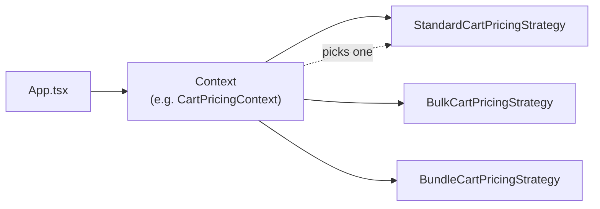

# Strategy Pattern in the Front-End (React + TypeScript)

> **Languages:** [Português (BR)](README.md) · **English**

Study and demo repository for the **Strategy pattern** applied to React UIs. The goal is to show how to encapsulate varying behaviors (rendering, calculations, integrations) in interchangeable classes or modules while keeping the consuming component simple and stable.

---

## Table of contents

- [What is the Strategy pattern](#what-is-the-strategy-pattern)
- [When to use it in the front-end](#when-to-use-it-in-the-front-end)
- [When not to use it](#when-not-to-use-it)
- [Advantages and disadvantages](#advantages-and-disadvantages)
- [Strategy vs common alternatives](#strategy-vs-common-alternatives)
- [Examples implemented in this project](#examples-implemented-in-this-project)
- [Repository structure](#repository-structure)
- [How to run](#how-to-run)
- [How to extend](#how-to-extend)
- [Hypothetical examples (not implemented)](#hypothetical-examples-not-implemented)
- [References](#references)

---

## What is the Strategy pattern

**Strategy** defines a family of algorithms (or behaviors), encapsulates each one in a separate class, and makes them **interchangeable**. The client (here, a **Context** or `App.tsx`) delegates work to the active strategy without knowing implementation details.



In the front-end, “algorithm” can mean:

- How to **render** a UI block (different promotions).
- How to **calculate** a value (shipping, cart total).
- How to **run** a flow with side effects (notification, payment).

The pattern does not require classes: in TypeScript, interfaces + functions or objects work too. This project uses **classes + Context** to mirror classic design-pattern teaching material.

---

## When to use it in the front-end

Use Strategy when **all** (or most) of the conditions below hold:

| Signal | Example in this project |
|--------|-------------------------|
| There are **several variants** of the same behavior | Bonus vs percentage; economy vs express shipping |
| The variant is chosen at **runtime** (type, config, feature flag) | `discountType`, `optionType`, `CartPricingType` |
| The consumer should stay **stable** when adding variants | `App.tsx` only calls `promotionCardContext.renderDetails()` |
| Each variant’s logic **grows** or deserves its own module | `BundleCartPricingStrategy` with combo + premium |
| You want to **test** each rule in isolation | Pure calculation strategies without mounting the full React tree |

### Typical front-end cases

1. **UI variation** — cards, wizards, forms with different layouts per type.
2. **Client-side business rules** — pricing, shipping, tax, eligibility (prototyping or offline-first).
3. **Pluggable integrations** — payment gateway, map provider, report export.
4. **Side effects per channel** — toast, email, push (each channel = one strategy).
5. **Validation or formatting** — masks and rules per field type.

---

## When not to use it

Avoid Strategy (or prefer something simpler) when:

| Situation | Simpler alternative |
|-----------|---------------------|
| Only **two small, stable** branches | `if/else` or ternary |
| Only **style** changes (color, size) | Component variants + `className` / CVA |
| The “strategy” is **one line** | Inline function or value map |
| No **new variants** expected | YAGNI — don’t abstract too early |
| The team prefers **React composition** | Compound components, render props, specialized hooks |

Strategy adds files and indirection. The payoff shows up when new rules or screens would **break** a giant `switch` in the middle of JSX.

---

## Advantages and disadvantages

### Advantages

| Benefit | Why it matters on the front-end |
|---------|----------------------------------|
| **Open/Closed** | New promotion = new class + Context map entry, without rewriting `App.tsx`. |
| **Single responsibility** | `EconomyShippingStrategy` only knows economy shipping; checkout card doesn’t accumulate rules. |
| **Testability** | `calculateShippingCost(89.82)` and `calculateTotal()` testable without RTL on the full flow. |
| **Readability** | UI selector shows *which* strategy is active (`StrategyFlow` in the demo). |
| **Domain alignment** | Names like `BulkCartPricingStrategy` match product/business language. |
| **Runtime substitution** | Swap strategy when state changes (`useState` + new Context). |

### Disadvantages

| Limitation | Mitigation |
|------------|------------|
| **More files and boilerplate** | Keep interfaces lean; thin Context that only delegates. |
| **Learning curve** | Document the `type → Strategy` map (as in this README). |
| **Over-engineering risk** | Apply only when there are ≥3 variants or clear growth. |
| **Strategies with JSX** | Harder “pure” unit tests; extract calculation into pure functions when possible. |
| **Not idiomatic React** | Hooks + composition are common; Strategy complements, doesn’t replace. |
| **Instance per render** | Use `useMemo` on the Context (as in `App.tsx`) to avoid needless recreation. |

---

## Strategy vs common alternatives

| Approach | Good for | Limitation |
|----------|----------|------------|
| **`if/switch` in the component** | 1–2 local variations | Grows with the product; JSX and rules mixed |
| **Component map** `const X = { bonus: BonusCard }` | UI-only variation | Calculations end up outside or duplicated |
| **Hooks** `useCartPricing(type)` | Logic without classes | Can become a “god hook” with many internal `switch`es |
| **Compound components** | Flexible layout | Doesn’t model pricing/shipping algorithms well |
| **Strategy + Context** | UI + rules + frequent extension | More initial structure |

This repo positions Strategy as a **domain/presentation layer** between data (`get-cart.service.ts`) and UI (`App.tsx`).

---

## Examples implemented in this project

The app (`src/App.tsx`) exposes **three contexts** across two teaching sections. In each, the user switches strategy and sees the `Context → Strategy` flow in the UI.

### Example 1A — Promotions (`PromotionCardContext`)

**Problem:** promotion cards with **different layouts and content** (buy-one-get-one bonus vs percentage discount).

| Piece | Path |
|-------|------|
| Interface | `src/data/strategies/promotion-card-strategy/strategy.ts` |
| Strategies | `bonus-promotion-strategy.tsx`, `percentage-promotion-strategy.tsx` |
| Context | `promotion-card-strategy/index.ts` |
| Data | `src/data/services/get-promotion.service.ts` |

**Strategy selection:** `promotion.discountType` → `bonus` | `percentage`.

**Delegated methods:**

- `renderProductInfo()` — main product image and price
- `renderIcon()` — promotion type icon
- `renderDetails()` — free bonus items or discount % bar

**Teaching angle:** Strategy focused on **UI variation** (no full order calculation).

---

### Example 1B — Shipping (`ShippingOptionContext`)

**Problem:** same checkout area, but each option has its own **copy, icon, and shipping formula**.

| Piece | Path |
|-------|------|
| Interface | `shipping-option-strategy/strategy.ts` |
| Strategies | `economy-`, `express-`, `store-pickup-shipping-strategy.tsx` |
| Context | `shipping-option-strategy/index.ts` |
| Reference order | `get-sample-order.service.ts` (18 × R$ 4.99 = **R$ 89.82**) |

**Selection:** `shippingOption.optionType`.

**Delegated methods:**

- `renderName()`, `renderIcon()`, `renderDetails()`
- `calculateShippingCost(orderTotal)` — business rule

**Calculation rules (summary):**

| Strategy | Formula (order R$ 89.82) |
|----------|--------------------------|
| Economy | `baseCost (4.99) + 1.5% of order` → ~**R$ 6.34** |
| Express | `baseCost (12.99) + 3% of order` → ~**R$ 15.68** |
| Store pickup | `0` if order ≥ R$ 50; else R$ 5.99 → **R$ 0** |

**Teaching angle:** Strategy with **UI + calculation** in the same contract.

---

### Example 2 — Cart pricing (`CartPricingContext`)

**Problem:** one `CartModel`, **three pricing policies** (standard, volume, premium bundle).

| Piece | Path |
|-------|------|
| Interface | `cart-pricing-strategy/strategy.ts` |
| Strategies | `standard-`, `bulk-`, `bundle-cart-pricing-strategy.tsx` |
| Context | `cart-pricing-strategy/index.ts` |
| Demo cart | `get-cart.service.ts` (subtotal **R$ 101.85**) |
| Utilities | `src/utils/cart.utils.ts` (`getCartSubtotal`, `roundMoney`) |

**Selection:** `CartPricingType` from the selector (`standard` | `bulk` | `bundle`).

**Delegated methods:**

- `renderTitle()`, `renderDescription()`, `renderBreakdown()`
- `calculateTotal()`

**Expected totals (current cart):**

| Strategy | Main rule | Total ~ |
|----------|-----------|---------|
| Standard | 5% if subtotal ≥ R$ 100 | **R$ 96.76** |
| Volume | 12% (≥5 units) / 20% (≥10 units) per item | **R$ 86.66** |
| Bundle | 15% on Coca+Fanta items + 5% premium on subtotal | **R$ 82.76** |

**Teaching angle:** Strategy **mostly business logic**, with a rich breakdown UI.

---

### Flow in `App.tsx` (repeated pattern)

```tsx
// 1. State picks the "type"
const [selectedCartPricing, setSelectedCartPricing] = useState<CartPricingType>("standard");

// 2. Input data
const cart = useMemo(() => getCart(), []);

// 3. Context resolves the strategy (useMemo avoids unnecessary recreation)
const cartPricingContext = useMemo(
  () => new CartPricingContext(selectedCartPricing, cart),
  [selectedCartPricing, cart]
);

// 4. UI only delegates — doesn’t know Bulk vs Bundle
const total = cartPricingContext.calculateTotal();
// ...
{cartPricingContext.renderBreakdown()}
```

The same pattern applies to `PromotionCardContext` and `ShippingOptionContext`.

---

## Repository structure

```
src/
├── App.tsx                          # Demo: selectors + delegation to Contexts
├── constants/strategy-labels.ts     # Teaching metadata (Context/Strategy names)
├── components/
│   ├── layout/                      # StrategyFlow, StrategySection, GlassPanel
│   └── ui/                          # Card, StrategySelector, ThemeToggle, …
├── data/
│   ├── models/                      # Domain types (Promotion, Shipping, Cart)
│   ├── services/                    # Mock data (get-cart, get-promotion, …)
│   └── strategies/
│       ├── promotion-card-strategy/
│       ├── shipping-option-strategy/
│       └── cart-pricing-strategy/   # Each folder: strategy.ts, *-strategy.tsx, index.ts
└── utils/
    ├── cart.utils.ts                # Subtotal and monetary rounding
    ├── date.utils.ts
    └── number.utils.ts
```

**Convention per use case:**

1. `strategy.ts` — shared interface (`PromotionCardStrategy`, etc.).
2. `*-strategy.tsx` — one class per variant.
3. `index.ts` — **Context** with `Record<Type, Constructor>` and delegating methods.

---

## How to run

```bash
npm install
npm run dev
```

Production build:

```bash
npm run build
npm run preview
```

Stack: **Vite**, **React 18**, **TypeScript**, **Tailwind CSS**.

---

## How to extend

To add a new use case to the demo:

1. Create types in `src/data/models/`.
2. Define the interface in `src/data/strategies/{case}/strategy.ts`.
3. Implement each variant in `*-strategy.tsx`.
4. Register in the Context map in `index.ts`.
5. Expose mock data in `src/data/services/` (if needed).
6. Add selector and UI block in `App.tsx` + entry in `strategy-labels.ts`.

`App.tsx` should stay **without** a giant business-rule `switch` — only instantiate the Context and call its public API.

---

## Hypothetical examples (not implemented)

The sections below illustrate natural extensions of the same design. They are not in the codebase to keep the demo focused; use them as mental exercises or next steps.

### 1. `PaymentContext` — payment gateway

**Scenario:** checkout with PIX, card, and bank slip (boleto). Each has different flow, validation, and API calls.

```ts
// strategy.ts
export interface PaymentStrategy {
  readonly id: "pix" | "card" | "billet";
  validate(form: PaymentForm): ValidationResult;
  submit(orderId: string, form: PaymentForm): Promise<PaymentResult>;
  renderInstructions(): React.ReactNode;
  renderFormFields(): React.ReactNode;
}

// index.ts — PaymentContext
const strategiesMap = {
  pix: PixPaymentStrategy,
  card: CardPaymentStrategy,
  billet: BilletPaymentStrategy,
} satisfies Record<PaymentType, new (...args: never[]) => PaymentStrategy>;

export class PaymentContext {
  constructor(type: PaymentType) {
    this.strategy = new strategiesMap[type]();
  }
  submit(orderId: string, form: PaymentForm) {
    return this.strategy.submit(orderId, form);
  }
}
```

**Why Strategy here:** `CheckoutPage` doesn’t need to know whether the backend expects a QR code, card token, or payment line.

---

### 2. `NotificationContext` — side effects per channel

**Scenario:** the same success/error message sent via toast, email, or push — different APIs and prerequisites.

```ts
export interface NotificationPayload {
  title: string;
  body: string;
  severity: "info" | "success" | "error";
}

export interface NotificationStrategy {
  send(payload: NotificationPayload): Promise<void>;
}

export class ToastNotificationStrategy implements NotificationStrategy {
  async send(payload: NotificationPayload) {
    toast[payload.severity](payload.title, { description: payload.body });
  }
}

export class EmailNotificationStrategy implements NotificationStrategy {
  async send(payload: NotificationPayload) {
    await fetch("/api/notifications/email", {
      method: "POST",
      body: JSON.stringify(payload),
    });
  }
}

export class NotificationContext {
  constructor(private strategy: NotificationStrategy) {}
  notify(payload: NotificationPayload) {
    return this.strategy.send(payload);
  }
}

// Usage in App — inject by user preference or feature flag
const notification = new NotificationContext(
  user.prefersEmail ? new EmailNotificationStrategy() : new ToastNotificationStrategy()
);
await notification.notify({ title: "Order confirmed", body: "…", severity: "success" });
```

**Takeaway:** Strategy isn’t only JSX — it encapsulates **side effects** behind the same `send()` interface.

**React caveat:** for lifecycle-bound effects, combine with hooks (`useNotification`) that pick the strategy internally, avoiding creating a Context on every render without `useMemo`/a factory.

---

### 3. `FieldValidationContext` — validation per field type

**Scenario:** form with CPF, CNPJ, email, and postal code — different rules and messages.

```ts
export interface FieldValidationStrategy {
  normalize(value: string): string;
  validate(value: string): { valid: boolean; message?: string };
}

export class CpfValidationStrategy implements FieldValidationStrategy {
  normalize(value: string) {
    return value.replace(/\D/g, "").slice(0, 11);
  }
  validate(value: string) {
    // check digit algorithm…
    return { valid: isValidCpf(value) };
  }
}
```

`<ControlledInput strategy={cpfStrategy} />` stays generic.

---

### 4. `ExportReportContext` — output format

**Scenario:** export the same report as CSV, JSON, or PDF.

```ts
export interface ExportStrategy {
  readonly mimeType: string;
  readonly extension: string;
  build(data: ReportRow[]): Blob | Promise<Blob>;
}

export class CsvExportStrategy implements ExportStrategy {
  mimeType = "text/csv";
  extension = "csv";
  build(rows: ReportRow[]) {
    const csv = [headers, ...rows.map(formatRow)].join("\n");
    return new Blob([csv], { type: this.mimeType });
  }
}
```

Useful when **data shape is the same** and only the serializer changes.

---

### 5. `AuthProviderContext` — social login (integration)

**Scenario:** “Sign in with Google / GitHub / Apple” — different URLs, scopes, and token parsing.

Same contract: `signIn(): Promise<Session>`. The login button only picks the strategy by which icon was clicked.

---

### Hypothetical comparison

| Context | Variant by | UI? | Side effect? | Typical complexity |
|---------|------------|-----|--------------|-------------------|
| Payment | `PaymentType` | Yes (form) | Yes (API) | High |
| Notification | channel / preference | Optional | Yes | Medium |
| FieldValidation | field type | No | No | Low |
| ExportReport | format | No (download) | Yes (file) | Medium |
| AuthProvider | OAuth provider | Yes (button) | Yes | High |

---

## Checklist: is this project enough?

To **learn Strategy on the React front-end**, the three implemented examples are sufficient:

- **Visual** variation (promotions)
- **Visual + calculation** (shipping)
- **Composite rules** (cart)

Add new code only to demonstrate another axis (payment, notification, validation) — or document hypotheticals as above without bloating the demo UI.

---

## References

- [Strategy — Refactoring Guru](https://refactoring.guru/design-patterns/strategy)
- [Design Patterns: Elements of Reusable Object-Oriented Software](https://en.wikipedia.org/wiki/Design_Patterns) (GoF)
- Project docs: interfaces in `src/data/strategies/*/strategy.ts` and interactive demo in `src/App.tsx`

---

## License

Educational project — use and adapt freely for study and presentations.
