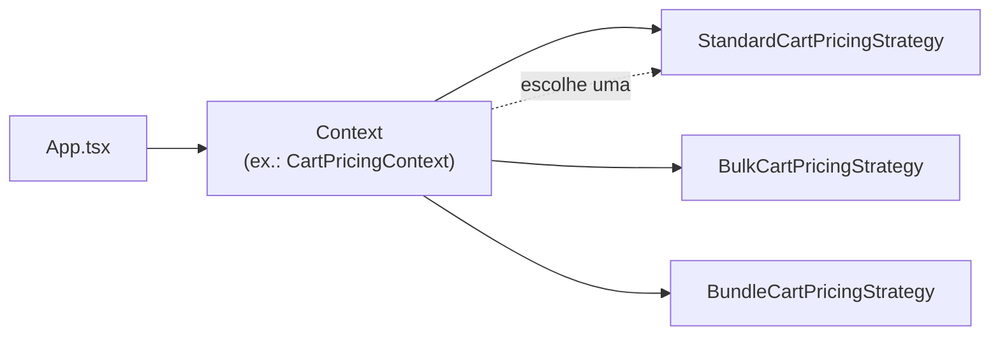

# Strategy Pattern no Front-End (React + TypeScript)

> **Idiomas / Languages:** **Português (BR)** · [English](README.en.md)

Repositório de estudo e demonstração do **padrão Strategy** aplicado a interfaces React. O objetivo é mostrar como encapsular comportamentos que variam (renderização, cálculos, integrações) em classes ou módulos intercambiáveis, mantendo o componente consumidor simples e estável.

---

## Índice

- [O que é o Strategy Pattern](#o-que-é-o-strategy-pattern)
- [Quando usar no front-end](#quando-usar-no-front-end)
- [Quando não usar](#quando-não-usar)
- [Vantagens e desvantagens](#vantagens-e-desvantagens)
- [Strategy vs alternativas comuns](#strategy-vs-alternativas-comuns)
- [Exemplos implementados neste projeto](#exemplos-implementados-neste-projeto)
- [Estrutura do repositório](#estrutura-do-repositório)
- [Como executar](#como-executar)
- [Como estender](#como-estender)
- [Exemplos hipotéticos (não implementados)](#exemplos-hipotéticos-não-implementados)
- [Referências](#referências)

---

## O que é o Strategy Pattern

O **Strategy** define uma família de algoritmos (ou comportamentos), encapsula cada um em uma classe separada e os torna **intercambiáveis**. O cliente (no nosso caso, um **Context** ou o `App.tsx`) delega o trabalho para a estratégia ativa sem conhecer os detalhes da implementação.



No front-end, “algoritmo” pode significar:

- Como **renderizar** um bloco de UI (promoções diferentes).
- Como **calcular** um valor (frete, total do carrinho).
- Como **executar** um fluxo com efeitos colaterais (notificação, pagamento).

O padrão não exige classes: em TypeScript, interfaces + funções ou objetos também funcionam. Este projeto usa **classes + Context** para deixar a analogia com design patterns clássicos explícita em material de estudo.

---

## Quando usar no front-end

Use Strategy quando **todas** as condições abaixo forem verdadeiras (ou a maioria):

| Sinal | Exemplo no projeto |
|--------|-------------------|
| Existem **várias variantes** do mesmo comportamento | Bônus vs porcentagem; frete econômico vs expresso |
| A variante é escolhida em **tempo de execução** (tipo, config, feature flag) | `discountType`, `optionType`, `CartPricingType` |
| O consumidor deve permanecer **estável** ao adicionar variantes | `App.tsx` só chama `promotionCardContext.renderDetails()` |
| A lógica de cada variante **cresce** ou já é grande o suficiente para um módulo próprio | `BundleCartPricingStrategy` com combo + premium |
| Você quer **testar** cada regra isoladamente | Estratégias puras de cálculo sem montar a árvore React inteira |

### Casos típicos no front

1. **Variação de UI** — cards, wizards, formulários com layout diferente por tipo.
2. **Regras de negócio no cliente** — preço, frete, impostos, elegibilidade (prototipagem ou offline-first).
3. **Integrações plugáveis** — gateway de pagamento, provedor de mapa, exportação de relatório.
4. **Efeitos colaterais por canal** — toast, e-mail, push (cada canal = estratégia).
5. **Validação ou formatação** — máscaras e regras por tipo de campo.

---

## Quando não usar

Evite Strategy (ou use algo mais simples) quando:

| Situação | Alternativa mais simples |
|----------|---------------------------|
| Apenas **2 ramos** estáveis e pequenos | `if/else` ou operador ternário |
| Só muda **estilo** (cor, tamanho) | Variantes de componente + `className` / CVA |
| A “estratégia” é **uma linha** | Função inline ou mapa de valores |
| Não há previsão de **novas variantes** | YAGNI — não abstraia cedo demais |
| Toda a equipe prefere **composição React** | Compound components, render props, hooks especializados |

O Strategy adiciona arquivos e indireção. O ganho aparece quando novas regras ou telas **quebrariam** um `switch` gigante no meio do JSX.

---

## Vantagens e desvantagens

### Vantagens

| Benefício | Por quê importa no front |
|-----------|---------------------------|
| **Open/Closed** | Nova promoção = nova classe + entrada no mapa do Context, sem reescrever `App.tsx`. |
| **Responsabilidade única** | `EconomyShippingStrategy` só conhece frete econômico; o card de checkout não acumula regras. |
| **Testabilidade** | `calculateShippingCost(89.82)` e `calculateTotal()` testáveis sem RTL em todo o fluxo. |
| **Legibilidade** | O seletor na UI mostra *qual* estratégia está ativa (`StrategyFlow` no demo). |
| **Alinhamento com domínio** | Nomes como `BulkCartPricingStrategy` conversam com produto/negócio. |
| **Substituição em runtime** | Troca de estratégia ao mudar estado (`useState` + novo Context). |

### Desvantagens

| Limitação | Mitigação |
|-----------|-----------|
| **Mais arquivos e boilerplate** | Manter interfaces enxutas; Context fino que só delega. |
| **Curva de aprendizado** | Documentar o mapa `type → Strategy` (como neste README). |
| **Risco de over-engineering** | Aplicar só quando há ≥3 variantes ou crescimento claro. |
| **Estratégias com JSX** | Dificulta testes unitários “puros”; separar cálculo em funções puras quando possível. |
| **Não é “padrão React idiomático”** | Hooks + composição são comuns; Strategy complementa, não substitui. |
| **Instância por render** | Usar `useMemo` no Context (como em `App.tsx`) para não recriar à toa. |

---

## Strategy vs alternativas comuns

| Abordagem | Bom para | Limitação |
|-----------|----------|-----------|
| **`if/switch` no componente** | 1–2 variações locais | Cresce com o produto; JSX e regra misturados |
| **Mapa de componentes** `const X = { bonus: BonusCard }` | Variação só de UI | Cálculos acabam fora ou duplicados |
| **Hooks** `useCartPricing(type)` | Lógica sem classes | Pode virar hook “deus” com muitos `switch` internos |
| **Compound components** | Layout flexível | Não modela bem algoritmos de preço/frete |
| **Strategy + Context** | UI + regra + extensão frequente | Mais estrutura inicial |

Este repositório posiciona o Strategy como **camada de domínio/apresentação** entre os dados (`get-cart.service.ts`) e a UI (`App.tsx`).

---

## Exemplos implementados neste projeto

A aplicação (`src/App.tsx`) expõe **três contextos** em duas seções didáticas. Em cada uma, o usuário troca a estratégia e vê o fluxo `Context → Strategy` na interface.

### Exemplo 1A — Promoções (`PromotionCardContext`)

**Problema:** cartões de promoção com **layouts e conteúdos diferentes** (bônus “compre e ganhe” vs desconto percentual).

| Peça | Caminho |
|------|---------|
| Interface | `src/data/strategies/promotion-card-strategy/strategy.ts` |
| Estratégias | `bonus-promotion-strategy.tsx`, `percentage-promotion-strategy.tsx` |
| Context | `promotion-card-strategy/index.ts` |
| Dados | `src/data/services/get-promotion.service.ts` |

**Seleção da estratégia:** `promotion.discountType` → `bonus` | `percentage`.

**Métodos delegados:**

- `renderProductInfo()` — imagem e preço do produto principal
- `renderIcon()` — ícone do tipo de promoção
- `renderDetails()` — bônus grátis ou barra de desconto %

**Dimensão didática:** Strategy focado em **variação de UI** (sem cálculo de pedido completo).

---

### Exemplo 1B — Frete (`ShippingOptionContext`)

**Problema:** mesma área de checkout, mas cada modalidade tem **copy, ícone e fórmula de frete** próprios.

| Peça | Caminho |
|------|---------|
| Interface | `shipping-option-strategy/strategy.ts` |
| Estratégias | `economy-`, `express-`, `store-pickup-shipping-strategy.tsx` |
| Context | `shipping-option-strategy/index.ts` |
| Pedido de referência | `get-sample-order.service.ts` (18 × R$ 4,99 = **R$ 89,82**) |

**Seleção:** `shippingOption.optionType`.

**Métodos delegados:**

- `renderName()`, `renderIcon()`, `renderDetails()`
- `calculateShippingCost(orderTotal)` — regra de negócio

**Regras de cálculo (resumo):**

| Estratégia | Fórmula (pedido R$ 89,82) |
|------------|---------------------------|
| Econômico | `baseCost (4,99) + 1,5% do pedido` → ~**R$ 6,34** |
| Expresso | `baseCost (12,99) + 3% do pedido` → ~**R$ 15,68** |
| Retirada | `0` se pedido ≥ R$ 50; senão R$ 5,99 → **R$ 0** |

**Dimensão didática:** Strategy em **UI + cálculo** no mesmo contrato.

---

### Exemplo 2 — Precificação de carrinho (`CartPricingContext`)

**Problema:** um único `CartModel`, **três políticas de preço** (padrão, volume, combo premium).

| Peça | Caminho |
|------|---------|
| Interface | `cart-pricing-strategy/strategy.ts` |
| Estratégias | `standard-`, `bulk-`, `bundle-cart-pricing-strategy.tsx` |
| Context | `cart-pricing-strategy/index.ts` |
| Carrinho demo | `get-cart.service.ts` (subtotal **R$ 101,85**) |
| Utilitários | `src/utils/cart.utils.ts` (`getCartSubtotal`, `roundMoney`) |

**Seleção:** `CartPricingType` escolhido no seletor (`standard` | `bulk` | `bundle`).

**Métodos delegados:**

- `renderTitle()`, `renderDescription()`, `renderBreakdown()`
- `calculateTotal()`

**Totais esperados (carrinho atual):**

| Estratégia | Regra principal | Total ~ |
|------------|-----------------|---------|
| Padrão | 5% se subtotal ≥ R$ 100 | **R$ 96,76** |
| Volume | 12% (≥5 un.) / 20% (≥10 un.) por item | **R$ 86,66** |
| Combo | 15% em itens Coca+Fanta + 5% premium no subtotal | **R$ 82,76** |

**Dimensão didática:** Strategy **predominantemente de negócio**, com UI de breakdown rica.

---

### Fluxo no `App.tsx` (padrão repetido)

```tsx
// 1. Estado escolhe o "tipo"
const [selectedCartPricing, setSelectedCartPricing] = useState<CartPricingType>("standard");

// 2. Dados de entrada
const cart = useMemo(() => getCart(), []);

// 3. Context resolve a estratégia (useMemo evita recriação desnecessária)
const cartPricingContext = useMemo(
  () => new CartPricingContext(selectedCartPricing, cart),
  [selectedCartPricing, cart]
);

// 4. UI só delega — não conhece Bulk vs Bundle
const total = cartPricingContext.calculateTotal();
// ...
{cartPricingContext.renderBreakdown()}
```

O mesmo padrão se repete para `PromotionCardContext` e `ShippingOptionContext`.

---

## Estrutura do repositório

```
src/
├── App.tsx                          # Demo: seletores + delegação aos Contexts
├── constants/strategy-labels.ts     # Metadados didáticos (nomes Context/Strategy)
├── components/
│   ├── layout/                      # StrategyFlow, StrategySection, GlassPanel
│   └── ui/                          # Card, StrategySelector, ThemeToggle, …
├── data/
│   ├── models/                      # Tipos de domínio (Promotion, Shipping, Cart)
│   ├── services/                    # Dados mock (get-cart, get-promotion, …)
│   └── strategies/
│       ├── promotion-card-strategy/
│       ├── shipping-option-strategy/
│       └── cart-pricing-strategy/   # Cada pasta: strategy.ts, *-strategy.tsx, index.ts
└── utils/
    ├── cart.utils.ts                # Subtotal e arredondamento monetário
    ├── date.utils.ts
    └── number.utils.ts
```

**Convenção por caso de uso:**

1. `strategy.ts` — interface comum (`PromotionCardStrategy`, etc.).
2. `*-strategy.tsx` — uma classe por variante.
3. `index.ts` — **Context** com `Record<Tipo, Constructor>` e métodos que delegam.

---

## Como executar

```bash
npm install
npm run dev
```

Build de produção:

```bash
npm run build
npm run preview
```

Stack: **Vite**, **React 18**, **TypeScript**, **Tailwind CSS**.

---

## Como estender

Para adicionar um novo caso de uso ao demo:

1. Criar tipos em `src/data/models/`.
2. Definir a interface em `src/data/strategies/{caso}/strategy.ts`.
3. Implementar cada variante em `*-strategy.tsx`.
4. Registrar no mapa do Context em `index.ts`.
5. Expor dados mock em `src/data/services/` (se necessário).
6. Adicionar seletor e bloco na UI em `App.tsx` + entrada em `strategy-labels.ts`.

O `App.tsx` deve continuar **sem** `switch` gigante sobre regras de negócio — apenas instancia o Context e chama a API pública dele.

---

## Exemplos hipotéticos (não implementados)

Os blocos abaixo ilustram extensões naturais do mesmo desenho. Não estão no código para manter o demo focado; servem como exercício mental ou próximo passo.

### 1. `PaymentContext` — gateway de pagamento

**Cenário:** checkout com PIX, cartão e boleto. Cada um tem fluxo, validação e chamada de API diferentes.

```ts
// strategy.ts
export interface PaymentStrategy {
  readonly id: "pix" | "card" | "billet";
  validate(form: PaymentForm): ValidationResult;
  submit(orderId: string, form: PaymentForm): Promise<PaymentResult>;
  renderInstructions(): React.ReactNode;
  renderFormFields(): React.ReactNode;
}

// index.ts — PaymentContext
const strategiesMap = {
  pix: PixPaymentStrategy,
  card: CardPaymentStrategy,
  billet: BilletPaymentStrategy,
} satisfies Record<PaymentType, new (...args: never[]) => PaymentStrategy>;

export class PaymentContext {
  constructor(type: PaymentType) {
    this.strategy = new strategiesMap[type]();
  }
  submit(orderId: string, form: PaymentForm) {
    return this.strategy.submit(orderId, form);
  }
}
```

**Por que Strategy aqui:** o `CheckoutPage` não precisa saber se o backend espera QR Code, token de cartão ou linha digitável.

---

### 2. `NotificationContext` — efeitos colaterais por canal

**Cenário:** mesma mensagem de sucesso/erro enviada por toast, e-mail ou push — APIs e pré-requisitos distintos.

```ts
export interface NotificationPayload {
  title: string;
  body: string;
  severity: "info" | "success" | "error";
}

export interface NotificationStrategy {
  send(payload: NotificationPayload): Promise<void>;
}

export class ToastNotificationStrategy implements NotificationStrategy {
  async send(payload: NotificationPayload) {
    toast[payload.severity](payload.title, { description: payload.body });
  }
}

export class EmailNotificationStrategy implements NotificationStrategy {
  async send(payload: NotificationPayload) {
    await fetch("/api/notifications/email", {
      method: "POST",
      body: JSON.stringify(payload),
    });
  }
}

export class NotificationContext {
  constructor(private strategy: NotificationStrategy) {}
  notify(payload: NotificationPayload) {
    return this.strategy.send(payload);
  }
}

// Uso no App — injeção por preferência do usuário ou feature flag
const notification = new NotificationContext(
  user.prefersEmail ? new EmailNotificationStrategy() : new ToastNotificationStrategy()
);
await notification.notify({ title: "Pedido confirmado", body: "…", severity: "success" });
```

**Lição:** Strategy não é só JSX — encapsula **side effects** com a mesma interface `send()`.

**Cuidado no React:** para efeitos ligados ao ciclo de vida, combine com hooks (`useNotification`) que internamente escolhem a estratégia, evitando instanciar Context em todo render sem `useMemo`/factory.

---

### 3. `FieldValidationContext` — validação por tipo de campo

**Cenário:** formulário com CPF, CNPJ, e-mail e CEP — regras e mensagens diferentes.

```ts
export interface FieldValidationStrategy {
  normalize(value: string): string;
  validate(value: string): { valid: boolean; message?: string };
}

export class CpfValidationStrategy implements FieldValidationStrategy {
  normalize(value: string) {
    return value.replace(/\D/g, "").slice(0, 11);
  }
  validate(value: string) {
    // algoritmo de dígitos verificadores…
    return { valid: isValidCpf(value) };
  }
}
```

O componente `<ControlledInput strategy={cpfStrategy} />` permanece genérico.

---

### 4. `ExportReportContext` — formato de saída

**Cenário:** exportar o mesmo relatório em CSV, JSON ou PDF.

```ts
export interface ExportStrategy {
  readonly mimeType: string;
  readonly extension: string;
  build(data: ReportRow[]): Blob | Promise<Blob>;
}

export class CsvExportStrategy implements ExportStrategy {
  mimeType = "text/csv";
  extension = "csv";
  build(rows: ReportRow[]) {
    const csv = [headers, ...rows.map(formatRow)].join("\n");
    return new Blob([csv], { type: this.mimeType });
  }
}
```

Útil quando a **estrutura dos dados é a mesma** e só o serializador muda.

---

### 5. `AuthProviderContext` — login social (integração)

**Cenário:** “Entrar com Google / GitHub / Apple” — URLs, scopes e parsing de token diferentes.

Mesmo contrato: `signIn(): Promise<Session>`. O botão de login só escolhe a estratégia pelo ícone clicado.

---

### Comparativo dos hipotéticos

| Context | Variante por | UI? | Side effect? | Complexidade típica |
|---------|--------------|-----|--------------|---------------------|
| Payment | `PaymentType` | Sim (formulário) | Sim (API) | Alta |
| Notification | canal / preferência | Opcional | Sim | Média |
| FieldValidation | tipo do campo | Não | Não | Baixa |
| ExportReport | formato | Não (download) | Sim (arquivo) | Média |
| AuthProvider | provedor OAuth | Sim (botão) | Sim | Alta |

---

## Checklist: este projeto já cobre o suficiente?

Para **aprender Strategy no front React**, os três exemplos implementados são suficientes:

- Variação **visual** (promoções)
- **Visual + cálculo** (frete)
- **Regras compostas** (carrinho)

Adicione código novo só se quiser demonstrar um eixo extra (pagamento, notificação, validação) — ou documente hipotéticos como acima, sem inflar a UI do demo.

---

## Referências

- [Strategy — Refactoring Guru](https://refactoring.guru/design-patterns/strategy)
- [Design Patterns: Elements of Reusable Object-Oriented Software](https://en.wikipedia.org/wiki/Design_Patterns) (GoF)
- Documentação do projeto: interfaces em `src/data/strategies/*/strategy.ts` e demo interativo em `src/App.tsx`

---

## Licença

Projeto educacional — use e adapte livremente para estudos e apresentações.
